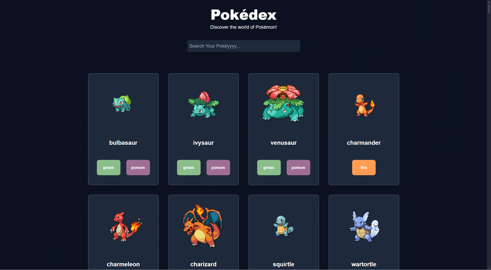

# Pokédex Web App🧑‍💻✨



## Table of Contents
- [Introduction](#introduction)
- [Features](#features)
- [Technologies](#technologies)
- [Installation](#installation)
- [Usage](#usage)
- [Backend Setup](#backend-setup)
- [Frontend Setup](#frontend-setup)
- [API](#api)
- [Contributing](#contributing)
- [License](#license)

## Introduction 💡
This is a simple **Pokédex Web Application** that allows users to explore and search through a list of Pokémon. It displays information about each Pokémon, including its types, height, weight, abilities, and evolutionary chain. The project fetches Pokémon data from the [PokéAPI](https://pokeapi.co/) and uses a mock backend to serve the data locally.

## Features 🌟
- Search Pokémon by name.
- Display Pokémon information such as type, height, weight, abilities, and evolution chain.
- Dynamic rendering with React.
- Beautiful UI with Tailwind CSS.
- Responsive design for mobile and desktop.

## Technologies 🔧
- **Frontend:** HTML, CSS (Tailwind), JavaScript (React)
- **Backend:** Node.js, JSON Server
- **API:** PokéAPI

## Installation 🚀

### Prerequisites
- Node.js installed on your machine.
- npm (comes with Node.js).

### Backend Setup

1. Clone the repository:
   ```bash
   git clone https://github.com/your-username/pokedex.git
   cd pokedex/backend
2. Install the dependencies:
   ```bash
   npm install
3. Generate the Pokémon database:
   ```bash
   npm run generate:db
4. Start the mock server:
   ```bash
   npm start
The mock server will be running at http://localhost:3000/pokemon.

### Frontend Setup

1. Open a new terminal, navigate to the frontend directory:
   ```bash
   cd ../frontend
2. Open index.html in your browser, or use a live server extension in your code editor to serve the frontend.

## Usage 🔍
Once both the backend and frontend are set up:
- Visit the frontend in your browser.
- Use the search bar to look for Pokémon by name.
- Explore different Pokémon types and their information.

## API 🌍
This project fetches data from the PokéAPI. The backend serves this data locally, 
and the frontend consumes it through http://localhost:3000/pokemon.

## Contributing 🤝
If you'd like to contribute:
1. Fork the repository.
2. Create a new branch (git checkout -b feature/your-feature).
3. Commit your changes (git commit -m 'Add some feature').
4. Push to the branch (git push origin feature/your-feature).
5. Create a new Pull Request.

## License 📜
This project is licensed under the MIT License - see the LICENSE file for details.
